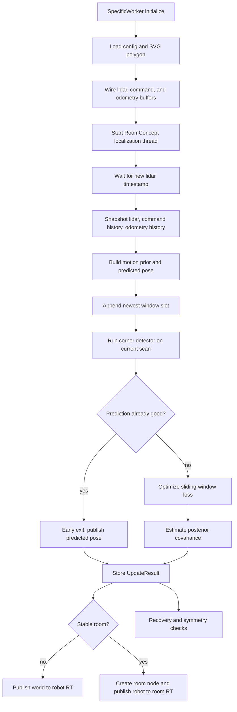
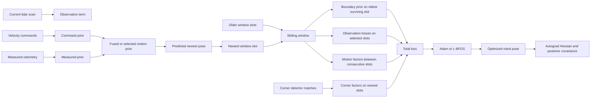

# ROOM_CONCEPT

This document describes the mathematics and execution flow used by the `room_concept` component to localize the robot inside a known room polygon.

The implementation is centered on `rc::RoomConcept` and is driven by `SpecificWorker`. In normal operation, `SpecificWorker` feeds lidar, command, and measured odometry into thread-safe buffers, and `RoomConcept` runs a dedicated localization thread that maintains the robot pose in the room frame.

The code lives mainly in:

- `src/specificworker.cpp`
- `src/room_concept.h`
- `src/room_concept.cpp`
- `src/room_model.h`
- `src/room_model.cpp`
- `src/corner_detector.h`
- `src/corner_detector.cpp`

## 1. What state is estimated

The historical API uses a 5D state vector:

$$
s = [w, h, x, y, \theta]
$$

where:

- `w, h` are room dimensions for the rectangular fallback model
- `x, y, theta` are the robot pose in the room frame

For the polygon-based room used in practice, only the robot pose is optimized. The polygon is fixed. So the effective estimation state is:

$$
q = [x, y, \theta]
$$

Implementation note:

- In polygon mode, `Model::half_extents` is still filled from the polygon bounding box for compatibility, but the actual geometry used for localization is `polygon_vertices` and its derived segment tensors.

## 2. Coordinate frames

Three frames matter:

1. Robot frame
   - Incoming lidar points are expressed here.
   - Commanded and measured velocities are integrated from this frame.

2. Room frame
   - The room polygon lives here.
   - The estimated pose `[x, y, theta]` maps robot-frame observations into this frame.

3. DSR publication frame
   - Before the room is declared stable, the system publishes `world -> robot`.
   - After stability, it creates a room node and publishes the inverse transform so the room becomes a child of the robot in the graph.

The robot-to-room transform used by the model is:

$$
p_{room} = R(\theta) p_{robot} + t,
\quad
t = \begin{bmatrix} x \\ y \end{bmatrix}
$$

with

$$
R(\theta) =
\begin{bmatrix}
\cos\theta & -\sin\theta \\
\sin\theta & \cos\theta
\end{bmatrix}
$$

This is implemented in `Model::sdf_query_at_pose`.

## 3. High-level lifecycle

### 3.1 Worker initialization

`SpecificWorker::initialize()` performs the component setup:

1. Loads configuration parameters from `etc/config.toml`.
2. Wires the thread-safe buffers into `RoomConcept::RunContext`.
3. Loads the room polygon from `beta_layout.svg` through `SvgRoomLoader`.
4. Calls `room_concept_.configure_room_from_polygon(...)`.
5. Sets the saved-pose file path (`etc/last_robot_pose.txt`).
6. Starts the localization thread with `room_concept_.start()`.

### 3.2 Data ingress

The estimator is event-driven by fresh lidar scans.

- `modify_node_slot(...)` listens for laser updates in DSR.
- It filters the 3D scan to keep the high band used for room geometry.
- It stores the result in `high_lidar_buffer_`.
- It calls `room_concept_.notify_new_lidar(ts)` to wake the localization thread.

Velocity commands and measured odometry are stored in separate circular buffers:

- `velocity_buffer_`
- `odometry_buffer_`

The command stream can come from two paths:

- DSR reference-speed attributes on the robot node
- `JoystickAdapter_sendData(...)`

Measured odometry comes from DSR current-speed attributes on the robot node. The worker can inject optional Gaussian noise into measured odometry before pushing it into the buffer, which is useful for stress-testing the estimator.

### 3.3 Localization thread loop

`RoomConcept::run()` is the main thread loop. On each cycle it:

1. Drains pending commands (`set pose`, `set polygon`, `grid search`).
2. Bootstraps the model if not initialized.
3. Waits for a new lidar timestamp.
4. Reads the latest lidar scan.
5. Takes snapshots of velocity and odometry history.
6. Calls `update(lidar, velocity_history, odometry_history)`.
7. Stores the last `UpdateResult`.
8. Optionally triggers recovery or symmetry correction.
9. Feeds visualization and DSR publication through `SpecificWorker`.

## 4. Bootstrap and initial pose selection

Before steady-state tracking, the system needs a first pose.

`bootstrap_initialization_from_lidar()` follows this strategy:

1. Try to load a saved pose from `etc/last_robot_pose.txt`.
2. If no saved pose exists, estimate a rough center and orientation from the first lidar scan.
3. Initialize the room model with that seed.
4. Run a global grid search for a better pose.
5. Resolve the `theta` versus `theta + pi` ambiguity.

### 4.1 Geometric bootstrap from the scan

If there is no saved pose, the code estimates the room center seen from the robot using `PointcloudCenterEstimator`:

- preferred path: oriented bounding box center and orientation
- fallback path: centroid plus PCA orientation

If the estimated room center in robot coordinates is `c_robot`, the initial room-frame robot translation is:

$$
t_0 = -R(\theta_0) c_{robot}
$$

This assumes the room center is at the room-frame origin.

### 4.2 Orientation ambiguity resolution

After initialization, `resolve_initial_yaw_ambiguity(...)` compares the fit at:

- `theta`
- `theta + pi`

using mean absolute boundary distance. If both fits are almost tied, it keeps the one closer to the prior heading.

### 4.3 Global grid search

> **Superseded 2026-09-16** by the mixture search in `src/reloc_search.h` (robust likelihood, yaws from wall
> structure, batched lattice, EM-polished modes, Laplace mode weights). The staged lattice below survives only
> as `legacy_grid_search_pose()` — the control arm of `tools/reloc_selftest` and `RelocLegacyGridSearch`.

`grid_search_initial_pose(...)` runs a staged search:

1. Symmetry flips at the current position.
2. A coarse global grid over the room bounds.
3. A local refinement around the best coarse candidates.

The score is the mean squared boundary distance:

$$
J(x, y, \theta) = \frac{1}{N} \sum_i d(p_i; x, y, \theta)^2
$$

where `d` is the room distance function evaluated at the candidate pose.

## 5. Room geometry model

The room model is implemented by `rc::Model`.

### 5.1 Polygon mode

For each polygon segment `[a_j, b_j]`, with `ab_j = b_j - a_j`, the closest point from a room-frame query point `p` to that segment is:

$$
t_j = \mathrm{clamp}\left(
\frac{(p-a_j)^T ab_j}{\|ab_j\|^2}, 0, 1
\right)
$$

$$
c_j = a_j + t_j ab_j
$$

$$
d_j^2 = \|p - c_j\|^2
$$

The model returns:

$$
d(p) = \min_j \|p - c_j\|
$$

Important implementation detail:

- In polygon mode this is an unsigned distance to the nearest wall segment.
- The code still names it `sdf`, but for polygons it is not a signed distance field.

The closest wall normal is also returned and later used for incidence-angle weighting.

### 5.2 Rectangular fallback mode

In rectangular mode the model uses the standard box signed-distance construction by combining outside distance and inside penetration depth.

In practice, the deployed workflow uses polygon mode loaded from SVG.

## 6. Observation model

Each lidar point contributes through the boundary-distance likelihood.

For a point cloud `P = {p_i}` in robot coordinates and pose `q = [x, y, theta]`, the room model produces distances:

$$
d_i(q) = d\big(R(\theta) p_i + t\big)
$$

The observation loss is a Huber-robustified quadratic term:

$$
L_{obs}(q) = \frac{1}{2\sigma_{obs}^2} \cdot \frac{1}{N}
\sum_i w_i \cdot \mathrm{Huber}(d_i(q); \delta)
$$

where:

- `sigma_obs = params.rfe_obs_sigma`
- `delta = params.rfe_huber_delta`
- `w_i` is an optional per-point weight

### 6.1 Range weighting

If enabled, far points receive more weight:

$$
w_i^{range} = \frac{r_i^{\alpha}}{\mathrm{mean}(r^{\alpha})}
$$

clamped below by a minimum weight, then renormalized.

This increases the angular leverage of distant wall returns.

### 6.2 Incidence-angle weighting

If enabled, the ray direction in room frame is compared against the nearest wall normal:

$$
w_i^{inc} = |\hat{r}_i \cdot \hat{n}_i|^{\beta}
$$

also clamped below by a minimum weight.

This suppresses grazing observations, which are more ambiguous for nearest-wall matching.

### 6.3 Health metric naming mismatch

`compute_sdf_mse_unscaled(...)` returns:

$$
\mathrm{median}_i |d_i|
$$

not a true mean squared error. The field is still stored as `sdf_mse` for historical reasons, but operationally it behaves as a robust median absolute wall-distance error.

## 7. Motion prior from commands and measured odometry

The estimator builds two separate motion priors over the interval between the previous and current lidar timestamps.

### 7.1 Command prior

`compute_odometry_prior(...)` integrates `VelocityCommand` samples over the lidar interval.

Each time segment contributes in robot frame:

$$
\Delta x_{local} = v_x \Delta t,
\quad
\Delta y_{local} = v_y \Delta t,
\quad
\Delta \theta = \omega \Delta t
$$

The translational part is rotated into the global room frame using midpoint heading:

$$
\theta_{mid} = \theta_{running} + \frac{1}{2}\Delta\theta
$$

$$
\Delta x = \Delta x_{local}\cos\theta_{mid} - \Delta y_{local}\sin\theta_{mid}
$$

$$
\Delta y = \Delta x_{local}\sin\theta_{mid} + \Delta y_{local}\cos\theta_{mid}
$$

### 7.2 Measured odometry prior

`compute_measured_odometry_prior(...)` does the same with measured robot-frame velocities:

- `side` is local `x`
- `adv` is local `y`
- `rot` is angular velocity

Again, midpoint integration is used.

### 7.3 Motion covariance model

For either prior, `compute_motion_covariance(...)` builds a diagonal covariance:

$$
\Sigma_{motion} = \mathrm{diag}(\sigma_p^2, \sigma_p^2, \sigma_\theta^2)
$$

with:

$$
\sigma_p = \sigma_{base} + k_t \|\Delta t_{xy}\|
$$

$$
\sigma_\theta = \sigma_{rot,base} + k_r |\Delta\theta|
$$

and a rotation-to-position coupling term:

$$
\sigma_p \leftarrow \sqrt{\sigma_p^2 + (k_{rp}|\Delta\theta|)^2}
$$

For measured odometry, angular slip can inflate rotational uncertainty:

$$
\sigma_{slip} = k_{slip} |\omega|
$$

$$
\sigma_\theta \leftarrow \sqrt{\sigma_\theta^2 + \sigma_{slip}^2}
$$

### 7.4 Online adaptation of the motion model

If enabled, the component learns three quantities online from post-optimization residuals:

1. `learned_slip_k`
2. `learned_odom_noise_trans`
3. `learned_odom_bias`

The residual per pair of window slots is:

$$
r_k = (q_k - q_{k-1}) - \Delta q_k^{odom}
$$

These learned values replace the static measured-odometry parameters after a warmup period.

## 8. Prior fusion and prediction

`build_motion_prior_selection(...)` computes:

- a command prior
- a measured odometry prior
- a fused prior if both are fresh and valid

Let:

$$
\mu_{cmd}, \Sigma_{cmd}
\quad\text{and}\quad
\mu_{odom}, \Sigma_{odom}
$$

be the predicted means and covariances of the two priors. The fusion is Gaussian:

$$
\Lambda_{fused} = \Sigma_{cmd}^{-1} + \Sigma_{odom}^{-1}
$$

$$
\Sigma_{fused} = \Lambda_{fused}^{-1}
$$

$$
\mu_{fused} = \Sigma_{fused}
\left(
\Sigma_{cmd}^{-1}\mu_{cmd} + \Sigma_{odom}^{-1}\mu_{odom}
\right)
$$

The heading is unwrapped before fusion so the mean is taken on a locally consistent branch, then wrapped back into `[-pi, pi]`.

If both priors are available, the fused one is used. Otherwise the estimator falls back to measured, then command, then zero motion.

The chosen prior is also written into the `Model` as a prediction mean and precision matrix.

## 9. EKF-style covariance propagation

Before optimization, `predict_step(...)` propagates the covariance with a linearized motion model:

$$
P^- = F P F^T + Q
$$

where:

- `P` is the previous covariance
- `Q` is the covariance of the selected motion prior
- `F` is the Jacobian of the kinematic update with respect to heading

For localized mode `[x, y, theta]`, the non-trivial Jacobian entries are:

$$
\frac{\partial x}{\partial \theta} = -\Delta x_{local}\sin\theta - \Delta y_{local}\cos\theta
$$

$$
\frac{\partial y}{\partial \theta} = \Delta x_{local}\cos\theta - \Delta y_{local}\sin\theta
$$

This propagated covariance becomes the prior covariance for the current frame.

## 10. Sliding-window realization of the objective

The estimator does not optimize just the current pose. It keeps a window of recent slots:

$$
\mathcal{W} = \{q_0, q_1, \dots, q_{W-1}\}
$$

Each slot stores:

- pose tensor `[x, y, theta]`
- lidar points
- odometry delta to the previous slot
- motion covariance and precision
- corner observations
- localization quality of that slot

When the window is full, the oldest slot is removed and a boundary prior is retained.

### 10.1 Boundary prior

If the window slides, the dropped oldest slot contributes a prior on the new oldest pose:

$$
L_{boundary}(q_0) = \frac{1}{2}(q_0 - \mu_b)^T \Lambda_b (q_0 - \mu_b)
$$

with angular residual wrapped through `atan2(sin, cos)`.

This is only applied when `window.size() > 1`. With `W = 1`, it would create a self-anchoring integrator and cause drift.

### 10.2 Full window loss

The total optimized objective is:

$$
L = L_{boundary} + \sum_k L_{obs}(q_k) + \sum_{k=1}^{W-1} L_{motion}(q_{k-1}, q_k) + \sum_k L_{corner}(q_k)
$$

where the motion term is:

$$
L_{motion} = \frac{1}{2} r_k^T \Lambda_k r_k
$$

$$
r_k = (q_k - q_{k-1}) - \Delta q_k^{odom}
$$

again with wrapped angular residual.

This is the practical heart of the estimator. Although the code uses the language of active inference and realized free energy, the implemented machinery is a differentiable sliding-window MAP estimator over SE(2) with robust observation and motion factors.

## 11. Corner factors

If corner tracking is enabled, the newest scan is also processed by `CornerDetector`.

### 11.1 Corner detection pipeline

For each model corner:

1. Transform the room-frame model corner into robot coordinates.
2. Gather scan points in a local search disk.
3. Filter candidate points against the two adjacent wall segments using:
   - along-wall bounds from the true wall lengths
   - a narrow perpendicular band around each wall
4. Fit one PCA line for each wall side.
5. Intersect the two lines.
6. Reject if angle, intersection distance, orientation, or convexity are inconsistent.
7. Use Hungarian assignment so overlapping search disks do not claim the same physical corner twice.

### 11.2 Corner observation model

If a corner with room-frame position `c_world` is matched, its predicted robot-frame observation for pose `q = [x, y, theta]` is:

$$
\hat{z} = R(-\theta)(c_{world} - t)
$$

The residual is:

$$
r_c = z_{detected} - \hat{z}
$$

and the corner factor is:

$$
L_{corner} = \frac{1}{2\sigma_c^2} w_H \|r_c\|^2
$$

where `w_H` is a Huber-style saturation weight based on `corner_huber_delta`.

Implementation note:

- The detector computes a 2x2 covariance for each corner match.
- The current loss does not use that directional covariance yet.
- The corner term uses a scalar `corner_obs_sigma` uniformly.

## 12. Early exit

Before running the optimizer, the code checks whether the predicted pose is already good enough.

Let:

$$
\bar{d}_{pred} = \mathrm{mean}_i |d_i(q_{pred})|
$$

The optimizer is skipped if:

$$
\bar{d}_{pred} < \sigma_{sdf} \cdot trust\_factor + k_{rot} |\Delta\theta|
$$

This makes the trust threshold looser during turns, where a small heading error can induce a larger wall-distance displacement.

If early exit fires:

- the predicted pose becomes the current result
- no Adam or L-BFGS step is run
- the window still receives the new slot
- the frame still updates diagnostics, quality, and learning state

## 13. Optimizers

Two optimizers are implemented.

### 13.1 Adam

`run_adam_loop(...)` performs iterative first-order optimization on the full window objective.

The learning rate is scaled by window size:

$$
lr_{eff} = \frac{lr}{\sqrt{W}}
$$

It also supports velocity-adaptive gradient weighting on the newest pose.

### 13.2 L-BFGS

`run_lbfgs_loop(...)` optimizes the same objective with line-search-based second-order updates.

The closure computes the full window loss and gradients, again optionally applying velocity-adaptive scaling to the newest-pose gradient.

### 13.3 Boundary prior quality gate

The previous frame's reported quality modulates the boundary prior weight:

$$
w_b = \min\left(1, \frac{\sigma_{sdf}^2}{\text{prev\_sdf\_mse}}\right)
$$

This prevents a bad previous pose from anchoring the optimizer too strongly.

## 14. Posterior covariance after optimization

After the pose is updated, the code computes a local covariance estimate from the observation Hessian:

$$
H_{obs} = \nabla^2 L_{obs}(q)
$$

The posterior precision is built as:

$$
\Lambda_{post} = P^{-1} + H_{obs} + \lambda I
$$

and the covariance is:

$$
\Sigma_{post} = \Lambda_{post}^{-1}
$$

Small eigenvalues of the observation Hessian are clamped to keep the matrix numerically stable.

The Hessian itself is computed with exact autograd second derivatives in `autograd_hessian_3x3(...)`.

## 15. Boundary prior recomputation when the window slides

After a slide, `WindowManager::recompute_boundary_prior(...)` updates the precision used for the oldest surviving slot.

There are two safety gates:

1. `mu` gate
   - If the dropped slot was poor quality, do not update the boundary mean.

2. Hessian gate
   - If the oldest surviving slot is poor quality, use only kinematic precision instead of `H_obs + H_motion`.

This prevents contaminated scans from creating overconfident anchors.

## 16. Recovery and symmetry handling

> **Superseded 2026-09-16.** Both mechanisms below were DELETED: they fought — the symmetry check teleported a
> lost robot to a mirror image on 74 of 80 checks (09-12), fired on a door opening with the robot 1.6 m inside
> (09-16), and reset the recovery counter on every flip. Replacement (`room_concept.cpp` section 8):
> - a three-state HMM belief {TRACKING, LOST, MISMATCH} on median |SDF|, tracking emission learnt online;
> - P(LOST) ≥ ½ fires the mixture search; the pose MOVES only if the new mode fits the way tracking does,
>   otherwise the belief goes to MISMATCH (the view changed; nothing to relocalise to);
> - the search's other modes are carried and scored every scan; a rival takes over only past Wald's SPRT
>   bound log((1−α)/α), α = `RelocHazard`, so an exact twin never flips and a real one wins in a few scans.
> Offline validation: `make -C build reloc_selftest && ../bin/reloc_selftest`. The text below is history.

The thread contains two mechanisms to escape bad local minima.

### 16.1 Recovery manager

If several consecutive optimized frames exceed a localization-error threshold, the system:

1. triggers a fresh grid search
2. clears the window
3. enters a cooldown

### 16.2 Periodic symmetry check

Polygonal rooms often admit mirrored or rotated solutions. Periodically, the code evaluates several transformed candidates:

- `(-x, -y, theta + pi)`
- `(-x,  y, pi - theta)`
- `( x, -y, -theta)`
- `(-x,  y, theta + pi)`

If any candidate gives clearly lower observation loss than the current pose, the pose is replaced and the window is cleared.

## 17. From estimator result to graph publication

`UpdateResult` contains:

- optimized pose
- covariance
- innovation with respect to the prediction
- corner matches
- the synchronized scan used for the update

`SpecificWorker` consumes that result and publishes it to DSR.

### 17.1 Pre-stable phase

Before the room is considered stable:

- the estimate is published as `world -> robot`
- the room node does not yet exist

### 17.2 Stable phase

Once enough consecutive stable frames are seen, `SpecificWorker`:

1. creates the room node
2. writes the polygon into the DSR room node
3. creates wall and floor nodes
4. switches publication so the graph stores `robot -> room`

This inversion is done explicitly from the estimated room-to-robot transform.

If the room-to-robot transform is `(R, t)`, then robot-to-room is:

$$
R^{-1} = R^T,
\quad
t_{robot \to room} = -R^T t
$$

The covariance is also transformed through the corresponding SE(2) Jacobian.

## 18. Practical interpretation of the full pipeline

Each new lidar scan triggers the following chain:

1. Read current room polygon and previous pose.
2. Integrate command and measured odometry over the lidar interval.
3. Convert them into Gaussian priors with covariances.
4. Fuse the priors when possible.
5. Propagate covariance with an EKF-style Jacobian.
6. Append a new slot to the sliding window at the predicted pose.
7. Detect room corners in the current scan and attach them to the newest slot.
8. If the predicted pose already fits the room well enough, accept it directly.
9. Otherwise optimize the sliding-window objective over pose variables.
10. Recompute posterior covariance around the optimized pose.
11. Update recovery, symmetry, logging, and graph publication.

That is the full localization loop.

## 19. Important implementation nuances

These details matter when reasoning about behavior:

1. Polygon mode uses unsigned nearest-wall distance, not a true signed inside/outside SDF.
2. `sdf_mse` is operationally a median absolute boundary error, not a mean squared error.
3. The estimator is windowed and factor-graph-like, even though the code refers to active inference and realized free energy.
4. Corner observations are optional and currently isotropic in the loss.
5. Recovery and symmetry correction are not afterthoughts; they are part of normal operation in ambiguous layouts.
6. The room polygon is fixed. The estimator solves only for the robot pose once the room is configured.

## 20. Minimal mental model

The simplest accurate way to think about `room_concept` is:

- Known room polygon.
- Unknown robot pose in that polygon.
- Prediction from command and measured odometry.
- Correction from lidar-to-wall distance and optional corner matches.
- Optimization over a short sliding window for temporal consistency.
- Covariance and recovery logic to make the result usable in the graph.

That is the mathematics and lifecycle currently implemented by this agent.